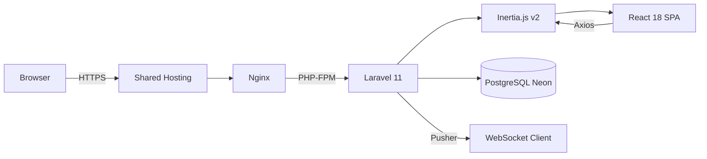
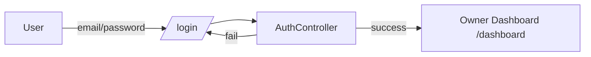
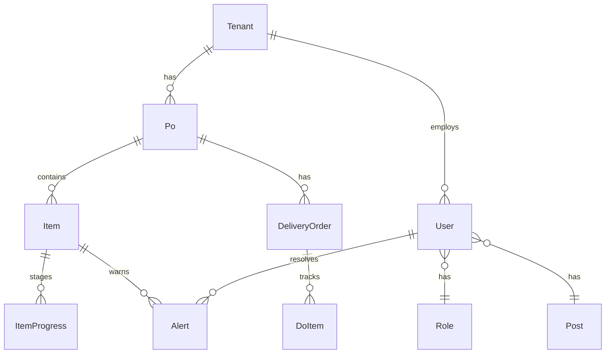
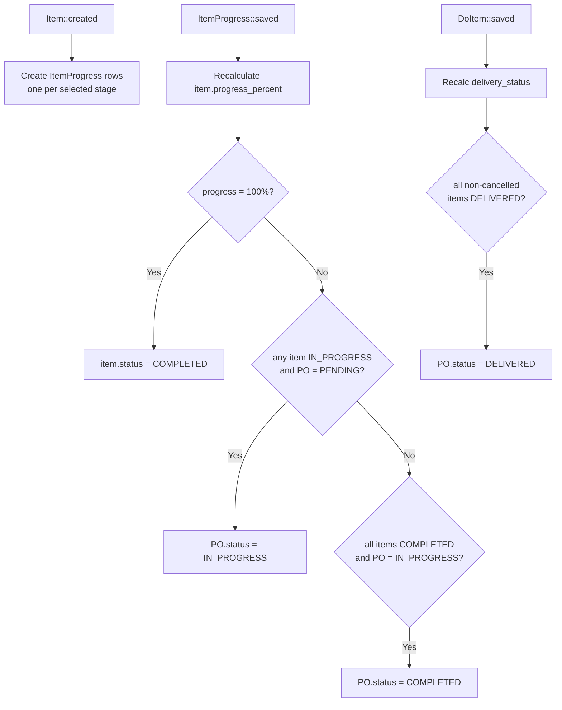

# POgrid.id — System Architecture

## 1. Request Flow



**No API routes.** All traffic flows through `routes/web.php`. Controllers return Inertia page responses.

---

## 2. Auth Flow

### Guard A — Office (password)



### Guard B — Floor (PIN)

```mermaid
flowchart LR
    Worker -->|select name + PIN| PinLogin[/c/{slug}/]
    PinLogin --> WorkerAuthController
    WorkerAuthController -->|success| WorkerDB[Worker Dashboard /c/{slug}]
    WorkerAuthController -->|fail| PinLogin
    note right of WorkerAuthController: 5 req/min throttle
```

**Privilege escalation protection:** Office role users blocked from PIN login.

---

## 3. Multi-Tenancy

```
app.pogrid.id/c/{slug}     ← no subdomains
        │
        └── TenantManager singleton
                │
                ├── Sets tenant_id in session
                ├── TenantScope on all models
                └── bypass()/enableScope() for admin/test contexts
```

**Row-level tenancy** — every operational model has `tenant_id` foreign key. `TenantScope` global scope filters automatically.

---

## 4. Data Model



### Core Entities

| Entity | Key Fields | Purpose |
|--------|-----------|---------|
| **Tenant** | `slug`, `name` | Workshop / company |
| **User** | `role_id`, `post_id`, `role_level` | Worker or office staff |
| **Role** | `name`, `display_name` | Permission engine (DRAFTER, MACHINING, QC, etc.) |
| **Post** | `name`, `display_name` | Job title label only (cosmetic) |
| **Po** | `po_number`, `client_name`, `global_deadline`, `status` | Purchase order |
| **Item** | `item_name`, `target_qty`, `item_type`, `required_stages`, `progress_percent`, `status` | Line item on PO |
| **ItemProgress** | `stage_name`, `completed_qty`, `progress_percent`, `status` | One row per admin-selected stage |
| **DeliveryOrder** | `do_number` | Auto-created per PO |
| **DoItem** | `delivered_qty` | Running total per trip |
| **Alert** | `severity`, `reason_type`, `message` | RED/YELLOW/BLUE alerts |

---

## 5. Observer Chain (Business Logic)

Business logic lives in Eloquent observers, NOT controllers.



### Observable Events

| Observer | Event | Action |
|----------|-------|--------|
| `ItemObserver` | `created` | Create ItemProgress rows for each selected stage |
| `ItemProgressObserver` | `saved` | Recalculate item progress, update item & PO status |
| `DoItemObserver` | `saved` | Recalculate delivery status, update PO → DELIVERED |
| *(Finance)* | Manual | Set invoice/payment status, PO → CLOSED when all paid |

---

## 6. Progress System

### Additive Delta Input

```
Worker logs +3 pcs → completed_qty += 3  (cap at target_qty)
Cancel last update  → revert to snapshot
```

### Progress Formula

**Multi-piece** (`target_qty > 1`):
```
Item % = Σ(completed_qty across ALL stages) / (target_qty × stage_count) × 100
```

**Single piece** (`target_qty == 1`):
```
Item % = Σ(stage progress%) / stage_count
```

### Status Transitions

```
item.status:  PENDING → IN_PROGRESS → COMPLETED → [DELIVERED/PAID]
                  ↓ CANCELLED (0% only)
                  ↓ TERMINATED (>0%, sunk-cost)
```

```
po.status:    PENDING → IN_PROGRESS → COMPLETED → DELIVERED → CLOSED
                  ↓ CANCELLED
```

---

## 7. Stage & Role System

### Stage Access Gate (`validateStageAccess`)

1. **Role-to-Stage matching** — `STAGE_ROLE_MAP` config array maps role keywords to stage names
2. **QC dependency gate** — All preceding stages must be COMPLETED before QC can update
3. **Catch-all** — Unmatched stages fall to PRODUCTION role

### QC Rework Flow

```
QC logs reject_qty → spawns "{stage} - REWORK" sub-stage
                   → original stage completed_qty -= reject_qty
                   → YELLOW alert created
                   → if item was COMPLETED, revert to IN_PROGRESS
                   → REWORK stage adds to numerator but NOT denominator
```

---

## 8. Alert System

| Severity | Trigger | Auto-resolve |
|----------|---------|-------------|
| 🔴 RED — Stuck | Worker clicks Lapor Kendala | Worker resumes logging |
| 🔴 RED — Overdue | Past deadline, item not done | Item reaches 100% |
| 🟡 YELLOW — Risk | ≤3 days left AND progress < 70% | Either condition clears |
| 🟡 YELLOW — Rework | QC logs reject_qty | Manual resolve |
| 🔵 BLUE | PIN reset requested | Admin approves |

Timeline evaluation runs via cron: `php artisan pogrid:evaluate-timelines` (every 1 min).

---

## 9. Deployment Architecture

```
                  ┌─────────────────────┐
                  │   Hostinger Shared   │
                  │                      │
                  │  Nginx → PHP-FPM     │
                  │  Laravel Application │
                  │  SQLite (session/    │
                  │    cache/queue)       │
                  │                      │
                  ├─────────────────────┤
                  │    Neon PostgreSQL   │
                  │   (cloud, external)  │
                  ├─────────────────────┤
                  │   Pusher (external)  │
                  │   WebSocket service  │
                  └─────────────────────┘
```

**No persistent daemons** — queue processed by cron every 1 min (`queue:work --stop-when-empty`).

---

## 10. Key Files

| Component | File |
|-----------|------|
| Progress update | `WorkerDashboardController::updateProgress()` |
| QC rework | `WorkerDashboardController::logQcRework()` |
| Stage access gate | `WorkerDashboardController::validateStageAccess()` |
| Finance update | `WorkerDashboardController::updateFinanceStatus()` |
| Tenant context | `app/Services/TenantManager.php` |
| Stage observer | `app/Observers/ItemProgressObserver.php` |
| Delivery observer | `app/Observers/DoItemObserver.php` |
| Item observer | `app/Observers/ItemObserver.php` |
| Timeline cron | `app/Console/Commands/EvaluateTimelines.php` |
| PIN reset | `app/Http/Controllers/PinResetController.php` |
| Auth (Office) | `app/Http/Controllers/AuthController.php` |
| Auth (Floor) | `app/Http/Controllers/WorkerAuthController.php` |
| Owner dashboard | `app/Http/Controllers/OwnerDashboardController.php` |
| Routes | `routes/web.php` |
| Owner pages | `resources/js/Pages/Owner/` |
| Worker pages | `resources/js/Pages/Worker/` |
| Auth pages | `resources/js/Pages/Auth/` |
| Shared components | `resources/js/Components/` |
