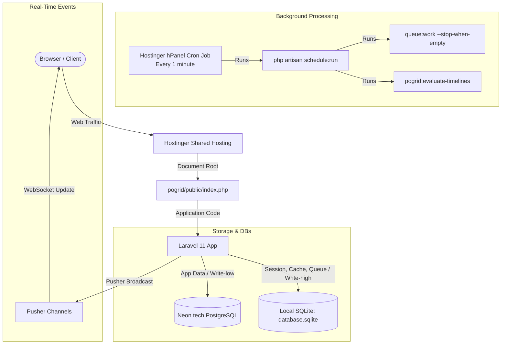

# POgrid.id — Hostinger Shared Hosting Deployment Plan

This deployment plan outlines the step-by-step process to deploy **POgrid** to a Hostinger Shared Hosting environment. Because shared hosting environments have strict resource limitations (no persistent background processes, memory limits, and CPU throttling), this plan is optimized for **zero-daemon operations** and **hybrid database routing**.

---

## 📊 Deployment Architecture



---

## 📋 Pre-Deployment Checklist

Before starting, ensure you have the following credentials and configurations ready:

### 1. Hostinger Account
- [ ] **SSH Access:** Enabled in Hostinger hPanel (*Advanced -> SSH Access*).
- [ ] **PHP Version:** Set to **PHP 8.3** or higher (*Advanced -> PHP Configuration*).
- [ ] **Domain / Subdomain:** Created and pointing to the server (e.g., `app.pogrid.id`).

### 2. External Services
- [ ] **PostgreSQL Database:** Neon.tech database URL, username, password, and port.
- [ ] **Pusher Account:** App ID, Key, Secret, and Cluster (free tier is sufficient).
- [ ] **SMTP Mail Server:** Hostinger SMTP credentials (host, port, user, password) for email notifications.

---

## 🛠️ Step-by-Step Deployment Steps

### Step 1: Local Pre-Build & Packaging
Shared hosting servers usually have very limited CPU and RAM. Running `npm run build` directly on Hostinger will likely crash or throttle your account. **Always compile frontend assets locally.**

1. Compile production frontend assets on your local machine:
   ```bash
   npm install --legacy-peer-deps --ignore-scripts
   chmod +x node_modules/.bin/*
   npm run build
   ```
   *This packages all React templates, TypeScript code, and Tailwind v4 CSS variables into the `public/build/` directory.*

2. Package the codebase (excluding temporary directories and source dependencies) into a single zip file:
   ```bash
   zip -r pogrid-release.zip . \
     -x "node_modules/*" \
     -x "vendor/*" \
     -x "storage/framework/cache/data/*" \
     -x "storage/framework/sessions/*" \
     -x "storage/framework/views/*" \
     -x "storage/logs/*" \
     -x "database/database.sqlite" \
     -x ".git/*" \
     -x ".bob/*" \
     -x ".claude/*" \
     -x "graphify-out/*"
   ```

---

### Step 2: Upload and Extract Code
For security and structure, we will place the project in a directory outside the default web root (`public_html`) and point the domain root to our `public` folder.

1. Connect to Hostinger via SSH or use the File Manager.
2. Upload the `pogrid-release.zip` file to your home directory (e.g., `/home/uXXXXXX/`).
3. Extract the archive into a folder named `pogrid`:
   ```bash
   mkdir -p pogrid
   unzip pogrid-release.zip -d pogrid
   cd pogrid
   ```

---

### Step 3: Install Production Dependencies
Run composer to install PHP dependencies. Since Hostinger CLI may enforce memory limits, we override the PHP memory limit for Composer.

```bash
COMPOSER_MEMORY_LIMIT=-1 composer install --no-dev --optimize-autoloader
```

---

### Step 4: Environment Variables & Dual-Database Routing
In shared hosting, sending session data, cache locks, and queue jobs over a remote network connection to Neon.tech PostgreSQL introduces latency and eats up Neon's connection pool. We will configure a hybrid setup:
- **Application Models & Data** → Neon.tech PostgreSQL (`pgsql` connection)
- **Sessions, Cache, Queues** → Local SQLite database (`sqlite` connection)

1. Create a production `.env` file:
   ```bash
   cp .env.example .env
   ```

2. Edit `.env` using `nano .env` and update the following settings:

   ```env
   APP_NAME=POgrid
   APP_ENV=production
   APP_DEBUG=false
   APP_URL=https://app.pogrid.id # Replace with your actual domain
   
   # Default Connection (App Data)
   DB_CONNECTION=pgsql
   DB_HOST=your-neon-database-host.neon.tech
   DB_PORT=5432
   DB_DATABASE=your_database_name
   DB_USERNAME=your_database_user
   DB_PASSWORD=your_database_password
   DB_SSLMODE=require
   
   # SQLite overrides for high-write operations
   SESSION_DRIVER=database
   SESSION_CONNECTION=sqlite
   
   CACHE_STORE=database
   DB_CACHE_CONNECTION=sqlite
   DB_CACHE_LOCK_CONNECTION=sqlite
   
   QUEUE_CONNECTION=database
   DB_QUEUE_CONNECTION=sqlite
   
   # Pusher Real-time Broadcaster
   BROADCAST_CONNECTION=pusher
   PUSHER_APP_ID=your_pusher_app_id
   PUSHER_APP_KEY=your_pusher_app_key
   PUSHER_APP_SECRET=your_pusher_app_secret
   PUSHER_APP_CLUSTER=your_pusher_cluster
   
   # SMTP Mail
   MAIL_MAILER=smtp
   MAIL_HOST=smtp.hostinger.com
   MAIL_PORT=587
   MAIL_USERNAME=noreply@pogrid.id
   MAIL_PASSWORD=your_mail_password
   MAIL_FROM_ADDRESS="noreply@pogrid.id"
   MAIL_FROM_NAME="${APP_NAME}"
   ```

3. Generate the application key:
   ```bash
   php artisan key:generate
   ```

---

### Step 5: Database Provisioning & Migrations
Because we are utilizing two different database connections, we must initialize the SQLite database file and migrate *both* databases.

1. **Initialize the local SQLite database:**
   ```bash
   touch database/database.sqlite
   chmod 775 database/database.sqlite
   chmod -R 775 database
   chmod -R 775 storage bootstrap/cache
   ```
   > [!IMPORTANT]
   > SQLite requires write permissions on the file *and* the directory it resides in (to write lock and journal files).

2. **Run Migrations on Neon.tech PostgreSQL (Default Connection):**
   ```bash
   php artisan migrate --force
   ```

3. **Run Migrations on Local SQLite (Session/Cache/Queue):**
   ```bash
   php artisan migrate --database=sqlite --force
   ```
   *This creates the `sessions`, `cache`, `cache_locks`, `jobs`, `job_batches`, and `failed_jobs` tables locally inside `database/database.sqlite`.*

---

### Step 6: Production Optimizations
Pre-cache all configurations, routing files, and views to improve response speed and decrease disk read operations.

```bash
php artisan config:cache
php artisan route:cache
php artisan view:cache
php artisan event:cache
```

---

### Step 7: Document Root Setup in Hostinger
To ensure security, do NOT point your domain's document root to the main project folder. It must point to `pogrid/public/`.

1. Log in to Hostinger hPanel.
2. Go to **Websites** -> Select your domain -> **Dashboard**.
3. Search for **Subdomains** or **Websites -> Change Directory / Domain folder**.
4. Change the folder path from `/public_html` to:
   `/pogrid/public`
5. Save the configuration. This routes all incoming traffic directly to `pogrid/public/index.php`.

---

### Step 8: Cron Job Configuration
Since Hostinger Shared Hosting does not support running persistent processes (like running `php artisan queue:work` indefinitely), we must schedule the worker to process any pending items and shut down gracefully using a cron job.

1. Go to Hostinger hPanel -> **Advanced** -> **Cron Jobs**.
2. Create a new Cron Job with the following details:
   - **Common settings:** Once per minute (`* * * * *`)
   - **Command:** Use the specific PHP version binary to execute the scheduler.
     ```bash
     /usr/bin/php8.3 /home/uXXXXXX/pogrid/artisan schedule:run >> /dev/null 2>&1
     ```
     *(Be sure to replace `uXXXXXX` with your actual Hostinger username).*

3. **Verify the cron scheduler configuration:**
   In [routes/console.php](file:///home/tito/pogrid/routes/console.php), ensure both the **queue worker** and the **timeline evaluator** are defined to run. 

   > [!WARNING]
   > Currently, `routes/console.php` only schedules the timeline evaluator to run **daily** and does not schedule the queue worker. To make the 1-minute cron job trigger queue processing, we should modify `routes/console.php` to define the schedule.
   > 
   > Recommended addition to `routes/console.php`:
   > ```php
   > Schedule::command('queue:work --stop-when-empty')->everyMinute()->withoutOverlapping();
   > Schedule::command('pogrid:evaluate-timelines')->everyMinute()->withoutOverlapping();
   > ```

---

## 🧪 Post-Deployment Verification Checklist

After deploying, verify the following systems are operating correctly:

- [ ] **App Liveness:** Open `https://app.pogrid.id/up` in your browser. It should return a `200 OK` status page.
- [ ] **Frontend Loading:** Access the login page. Check browser console logs for assets loading issues (404 errors for built files).
- [ ] **Office Auth (Guard A):** Attempt a login with a seeded account (e.g., username `sari`, password `poiuy`).
- [ ] **Floor PIN Auth (Guard B):** Access `https://app.pogrid.id/c/teknik-mandiri` and try PIN `0000` (e.g. for worker Arief Prasetyo).
- [ ] **Job Queue Processing:** Update an item stage or request a PIN reset, then check if the action triggers Pusher events or alerts without locking up the UI.
- [ ] **Storage Write Permissions:** Inspect `storage/logs/laravel.log` to ensure there are no permission errors writing to storage or database paths.

---

## ⚠️ Hostinger Specific Troubleshooting

| Issue | Potential Cause | Action to Resolve |
|---|---|---|
| **500 Internal Server Error** | Wrong folder permissions or `.htaccess` configuration. | Ensure `chmod -R 775 storage bootstrap/cache` is applied. Verify the document root is set to `/pogrid/public`. |
| **"table sessions not found" / "table cache not found"** | SQLite migrations were not run. | Run the SQLite migration command: `php artisan migrate --database=sqlite --force`. |
| **Queue jobs not processing** | Cron job path issue or missing scheduler definitions. | 1. Double check hPanel cron logs.<br>2. Confirm PHP binary version path (`/usr/bin/php8.3`).<br>3. Verify queue scheduling is added to `routes/console.php`. |
| **Pusher WebSocket connection failures** | Wrong cluster or invalid keys in `.env` | Inspect Pusher debug console and match with `.env` variables. Clear cache afterwards: `php artisan config:cache`. |
| **Syntax Errors in Log / Console** | Hostinger CLI PHP version defaulting to PHP 7.x or 8.0. | Specify `/usr/bin/php8.3` instead of generic `php` in SSH or cron jobs. |
