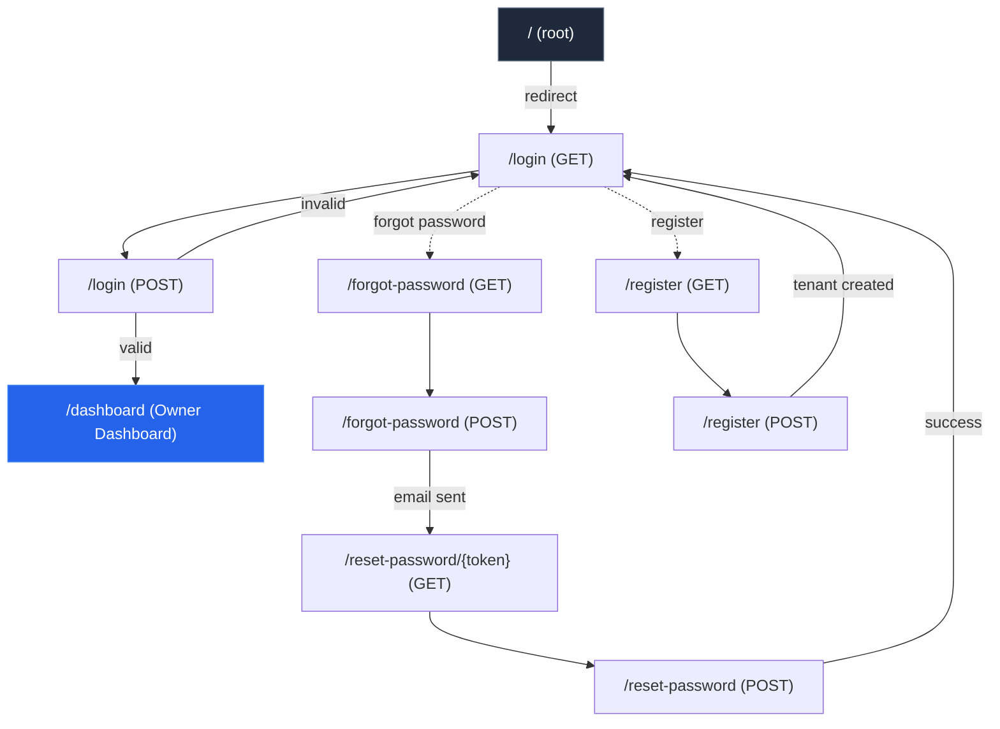
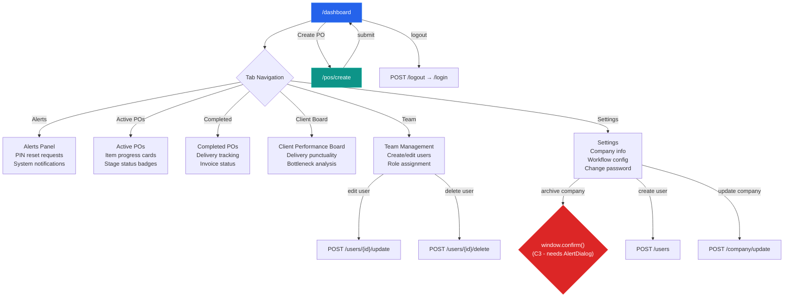
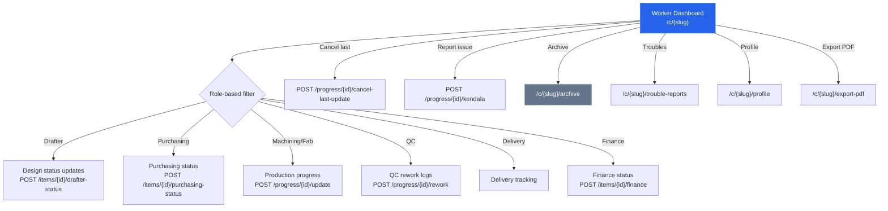
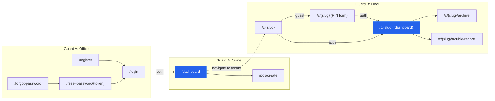

# POGrid UI/UX Flow Diagrams

Mermaid flowcharts of the audited UI flows. Paste these into any Mermaid-compatible renderer (GitHub markdown, mermaid.live, etc.).

---

## 1. Guard A — Office Auth Flow



## 2. Guard A — Owner Dashboard Flow



## 3. Guard B — Floor (Worker) Auth Flow

```mermaid
flowchart TD
    W["/c/{slug} (GET)"] --> IS_AUTH{"Authenticated?"}
    IS_AUTH -->|no| PIN["PIN Login Form<br/>/c/{slug} (same route)"]
    PIN -->|POST /c/{slug}/login| VALID{"PIN correct?"}
    VALID -->|yes| DASH["Worker Dashboard<br/>/c/{slug}"]
    VALID -->|no, throttled 5/min| PIN

    IS_AUTH -->|yes| DASH

    PIN -.->|forgot PIN| FR["POST /c/{slug}/pin-reset/request"]
    FR -->|BLUE Alert created| ADMIN["Admin approves<br/>POST /pin-reset/{alertId}/approve"]
    ADMIN -->|new PIN shown once| PIN

    style W fill:#1e293b,stroke:#64748b,color:#fff
    style DASH fill:#2563eb,stroke:#3b82f6,color:#fff
    style FR fill:#0891b2,stroke:#06b6d4,color:#fff
```

## 4. Guard B — Worker Dashboard Flow



## 5. Complete UI Flow Map (Simplified)



## Finding-to-Diagram Cross-Reference

| Finding | Diagram | Element |
|---|---|---|
| C1. TDZ bug | Owner Dashboard | `animatedActivityIds` / `recentActivity` ordering |
| C2. No retry on error | Owner Dashboard | Error state rendering |
| C3. window.confirm() | Owner Dashboard Flow | Settings → Archive (red node) |
| H1. No unsaved guard | Owner Dashboard, CreatePo | Form navigation edges |
| H2. Disabled btn a11y | Guard A Auth Flow | Login form submit button |
| H3. `<a>` full reloads | Owner Dashboard Flow | Tab navigation edges |
| H4. CreatePo flash | Owner Dashboard Flow | CreatePo form initialization |
| H5. Filter empty state | Worker Dashboard Flow | Role-based filter paths |
| H6. Sub-query loading | Worker Dashboard Flow | Dashboard data loading |
| H7. Unguarded queries | Owner Dashboard Flow | Dashboard charts section |
| M1. No keyboard help | All flows | Global shortcut overlay missing |
| M2. Missing empty states | Owner Dashboard Flow | Dashboard sub-sections |
| M3. No password toggle | Guard A Auth Flow | Login password field |
| M4. Cancel no confirm | Owner Dashboard Flow | CreatePo cancel edge |
| M5. No pagination | Worker Dashboard Flow | Item list in dashboard |
| M6. Inconsistent empty | All flows | Zero-data states across pages |
